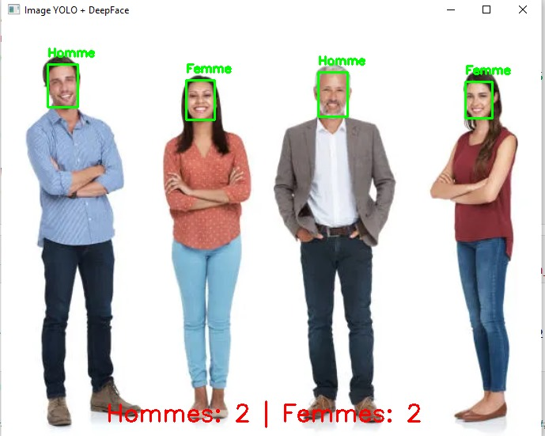

# 🏷️ FaceGenderCounter  

FaceGenderCounter is a **face detection and gender classification model** using **YOLO** for detection and **DeepFace** for classification.  
It allows **counting the number of males and females** detected, whether on an **image** or in **real-time** via webcam.  

---

## 📸 **Example Output**


---

## 📂 **Project Structure**  
                 FaceGenderCounter/ 
                      ├── models/ # Contains trained models
                      │ ├── yolov11/yolov11.pt # Base YOLO model
                      │ ├── FaceGenderCounterModel/
                      │ │ ├── face_gender_counter.pkl # Final saved model
                      ├── notebook/ # Jupyter Notebook for analysis & training
                      │ ├── detection_face_YOLO.ipynb
                      ├── weights/ # Trained YOLO model weights
                      │ ├── yolo/best.pt
                      │ ├── yolo/last.pt
                      ├── requirement.txt # List of dependencies
                      ├── README.md # Project documentation

---

## 🔧 **Installation & Execution**  

### 1️⃣ **Clone the Repository**  
Open a terminal and run:  
```bash
git clone https://github.com/imadnasri/FaceGenderCounter.git
cd FaceGenderCounter
```

### 2️⃣ Install Dependencies  
Install the required Python libraries:  

```bash
pip install -r requirements.txt
```

### 3️⃣ Test the Model on an Image
```python
from face_gender_counter import FaceGenderCounter

model = FaceGenderCounter("weights/yolo/best.pt")
model.detect_faces_from_image("path/to/image.jpg")
```
### 4️⃣ Run Real-Time Detection
```python
model.detect_faces_realtime()
```
## 📊 **How Does the Model Work?**  

1️⃣ **Dataset Preparation**  
The model is trained using the **[WIDER FACE dataset](https://shuoyang1213.me/WIDERFACE/)**, a large-scale face detection dataset.  
Bounding boxes from the dataset were **converted into YOLO format** to make them compatible with the YOLO model for training.  

2️⃣ **Face Detection with YOLO**  
YOLO detects **faces** in an image or video using the trained model.  

3️⃣ **Gender Classification with DeepFace**  
Each detected face is analyzed with **DeepFace** to **classify** the gender (**Male** or **Female**).  

4️⃣ **Visualization and Counting**  
The model displays **bounding boxes** with **labels** and keeps track of the number of detected **males and females** in the image or video stream.  

## ⚡ **Training Environment**  

To ensure **efficient training and high performance**, the YOLO model was trained on a **GPU** using **CUDA acceleration**.  
Training on GPU significantly reduced the time required compared to CPU-based execution.  

**Training Details:**  
- **Total Training Time:** **2.864 hours**  
- **GPU Used:** **NVIDIA RTX 3050**  
- **CUDA Version:** **12.4**  

**Setup for GPU Training:**  
If you are training the model yourself, ensure you have **CUDA installed** and PyTorch configured for GPU execution.  
To check if your setup is using CUDA, run:  

```python
import torch
print(torch.cuda.is_available())  # Should return True
print(torch.cuda.get_device_name(0))  # Should return "NVIDIA RTX 3050"
```

## 🚀 **Future Improvements**  
- **Integrate DeepSORT for Object Tracking**  
  Implement **DeepSORT (Simple Online and Realtime Tracker)** to track detected faces across multiple frames, reducing redundant detections and improving performance in real-time video processing.  

- **Deploy as an API using Flask or FastAPI**  
  Create a **REST API** with **Flask** or **FastAPI** to allow external applications to use the model for face detection and gender classification.  

- **Enhance the UI with Streamlit**  
  Develop a simple web interface using **Streamlit** to allow users to upload images or access real-time detection via a browser.  

## 🤝 Contributions  
If you would like to contribute, feel free to **fork** the repository and submit a **Pull Request**.  
Any suggestions or improvements are welcome!  

---

🎉 **Happy Coding!** 🚀  


